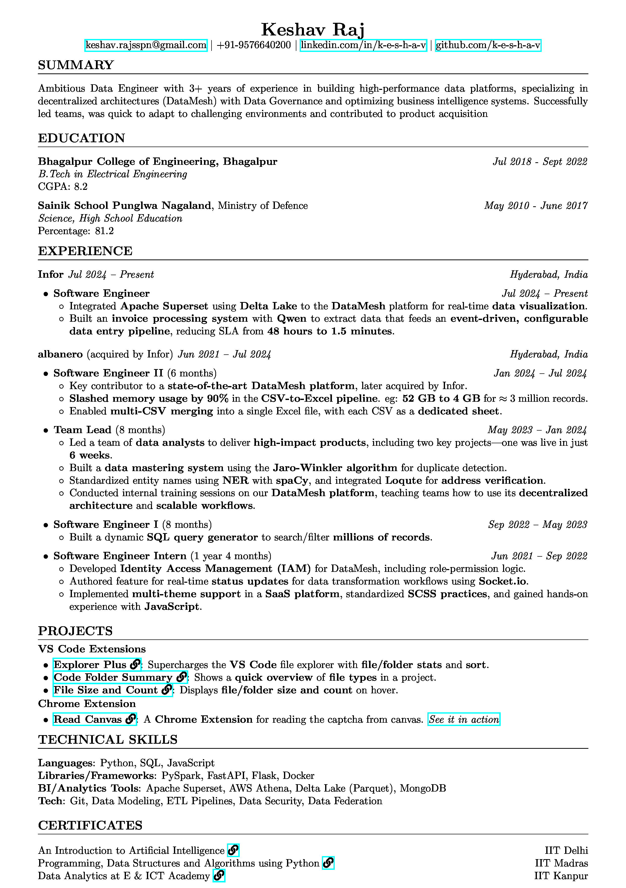

# 👋 Hi there, I'm Keshav
### I'm a Friend, Learner, Developer and a forking idiot !!
- 👀 I’m interested in UI and Data Engineering
- 🌱 I’m currently learning Browsers & Apache Superset
- 💞️ I’m looking to collaborate on large projects
- 📫 How to reach me keshav.rajsspn@gmail.com
- ⚡ I like to sketch

## My VS Code Extensions:

### Explorer++
 &nbsp; Shows file sizes and folder in webview.\
&nbsp; [Get it on the VS Code Marketplace](https://marketplace.visualstudio.com/items?itemName=k-e-s-h-a-v.explorer-plus)

### Code Folder Summary
&nbsp; Provides a quick, beautiful overview of the file types in your project.\
&nbsp; [Get it on the VS Code Marketplace](https://marketplace.visualstudio.com/items?itemName=k-e-s-h-a-v.code-folder-summary)

### FS++
&nbsp;Show file sizes and folder item counts directly in the VS Code Explorer.\
&nbsp;[Get it on the VS Code Marketplace](https://marketplace.visualstudio.com/items?itemName=k-e-s-h-a-v.file-size-and-count)

 

### Connect with me:

  
  

 

### Languages, frameworks and tools I am familier with:

 

### Resume: [View Full Size PDF](https://k-e-s-h-a-v.github.io/k-e-s-h-a-v/)

 

---
<!--  -->

[youtube]: https://www.youtube.com/@keshav_raj
[linkedin]: https://www.linkedin.com/in/k-e-s-h-a-v/

<!---
k-e-s-h-a-v/k-e-s-h-a-v is a ✨ special ✨ repository because its `README.md` (this file) appears on your GitHub profile.
You can click the Preview link to take a look at your changes.
--->
